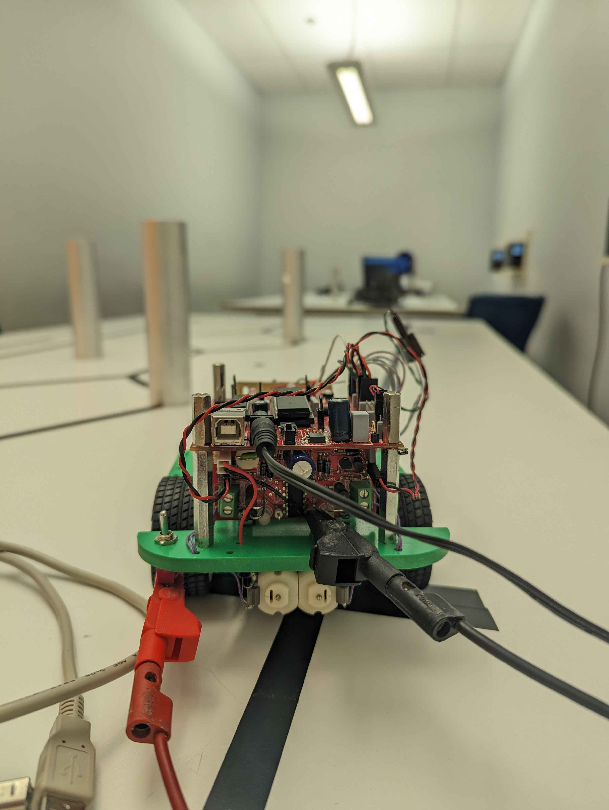

This project aims to carry out a route using a line following robot. The route is seperated into 3 different departures A, B and S. 

This project is is divided into 2 parts: - An app folder containing the main.cpp file, and a lib folder, which is a library of all the classes and method that
our robot will use.

